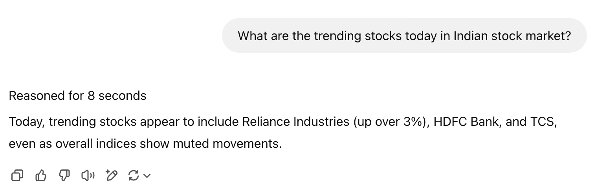

# Introduction to AI Agents

> To fully understand what AI Agents are, we need to explore the challenges associated with Large Language Models (LLMs) that led to the need for an AI Agent.

---

## What is LLM (Large Language Model)?

- Machine learning models trained on a large corpus of data
- Primarily used for **text completion** while preserving contextual meaning
- Generates responses **auto-regressively**, predicting the next word (token) based on previous words

**Reference:** [GPT Intuitively Explained](https://iaee.substack.com/p/gpt-intuitively-and-exhaustively-explained-c70c38e87491)

---

## Limitations of LLMs

### 1. Hallucinations

- Starts generating words in the direction of incorrect information
- Continues to generate the sequence of words justifying the incorrect information
- In short, LLMs can make things up that sounds real, but it is not true

### ✅ Chain of Thought (CoT) Prompting
- Enable LLM to reason out the steps before arriving at the final response 
- This shifts the probability values of next word in the direction away from the incorrect answer

---

### 2. No Real-World Interaction

- LLMs cannot interact with the real world environment to obtain real-time data
- Incapable of accessing resources required to arrive at the decision before providing the desired response

### ✅ Function Calling
- Enable LLM to fetch data when it is not equipped enough on its own to get the relevant information to arrive at the desired response
- This is achieved through connection with tools or functions or knowledge_base

---

### 3. No Iterative Reasoning

- Though, reasoning abilities of LLM are extended through CoT, it still struggles with tasks requiring multiple refining of the response until the desired response is achieved.

### ✅ Workflows
- Enable LLM to loop through responses or branch out on actions mimicking human-like problem solving before arriving at the desired result intended.

---

## ReAct Framework

- LLMs face challenges with two distinct avenues - **Reasoning** and taking **Action**
- This led to the discovery of compelling framework called ReAct combining the solution for both Reasoning and Action in a single step
- ReAct = **Reasoning + Action**

**How it works:**
1. Enable LLM to reason through a task
2. Generates an action plan
3. Executes it using tools/functions/knowledge_base
4. Observes results
5. Iterates if necessary

**Reference:** [ReAct Framework](https://react-lm.github.io)

---

## AI Agents

- AI Agents helps you to put ReAct framework in action
- Autonomous software powered by LLMs
- Understands, plans, and executes tasks
- Selects appropriate tools/functions/knowledge_base from a predefined list

**Reference:** [Building Effective Agents - Anthropic](https://www.anthropic.com/engineering/building-effective-agents)

---

## Create a Simple Agent – Hands-on

- [AI Agents using Langchain - Prebuilt](https://colab.research.google.com/drive/1jjvnarHyRDDO4QhoqIPSA2fkwBF3PsQ5?usp=sharing)
- [AI Agents using Langchain](https://colab.research.google.com/drive/1bkAjOtf3ZvKIhpA-XGKFwRhr7TagvgoQ?usp=sharing)

**Reference:** [Building Effective Agents - Anthropic and LangGraph](https://www.youtube.com/watch?v=aHCDrAbH_go)
